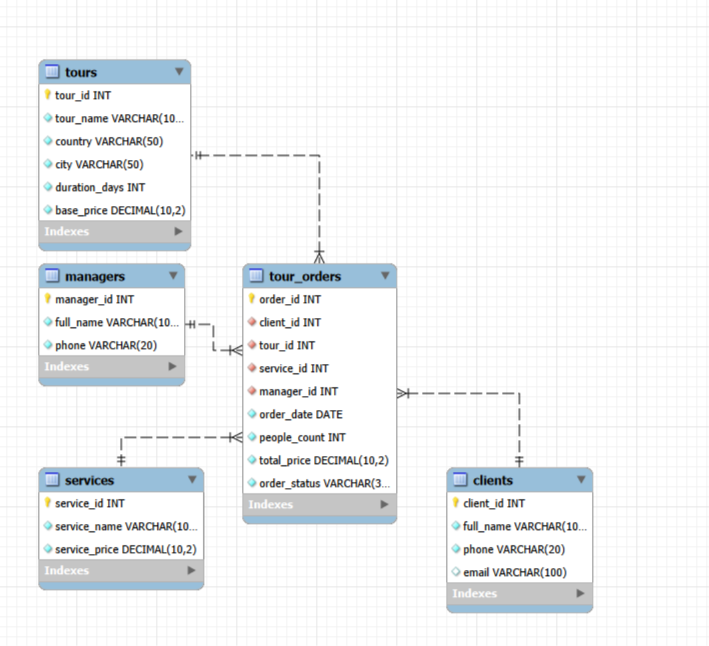

# Кейс-задача № 3

В этом задании была создана база данных «Туризм» в MySQL.

В базе данных используются таблицы:

- `clients` — клиенты;
- `tours` — туры;
- `services` — дополнительные услуги;
- `managers` — менеджеры;
- `tour_orders` — оформленные заказы.

Таблица заказов связана с остальными таблицами с помощью внешних ключей. Это сделано для того, чтобы не дублировать данные о клиентах, турах, услугах и менеджерах.

В SQL-скрипте создаётся база данных, создаются таблицы, добавляются тестовые данные и выполняется проверочный запрос с объединением таблиц.

Файл: `task_03_tourism.sql`

Для запуска можно использовать MySQL Workbench.

Нужно открыть SQL-файл, подключиться к серверу MySQL и выполнить весь скрипт.

## Результат

